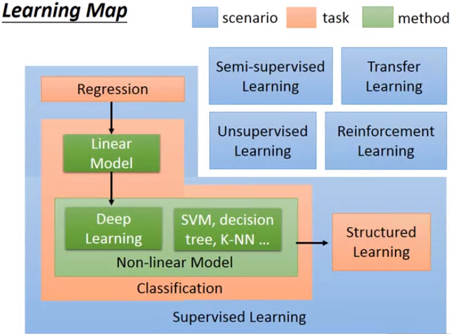

## Task01-P1P2笔记

### P1 机器学习介绍

#### Machine Learning Framework

##### 1.Supervise learning framework

Model

- Training (input training data)
- Testing (input testing data)

Step

- define a set of function
- goodness of function
- pick the best function

监督学习有预先给出真值—**Learning from teacher**

##### 2.Unsupervised learning

Machine learns the meaning of words from reading a lot of documents

##### 3.Reinforcement learning

给出其输出结果的分数，但不给出真值—**Learning from critics**

#### Learning Map

1.Regression

-the output of the target function f is "scalar"

2.Classification

- Binary classification   Yes or No

- Multi-class classification  c1,c2,c3...

  Function set

  choose model

  - Linear model
  - non-linear model-i.e Deep learning

  label

3.Structured learning

根据使用场景、任务确定方法