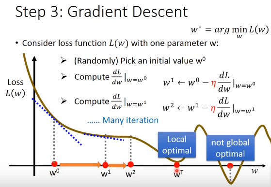
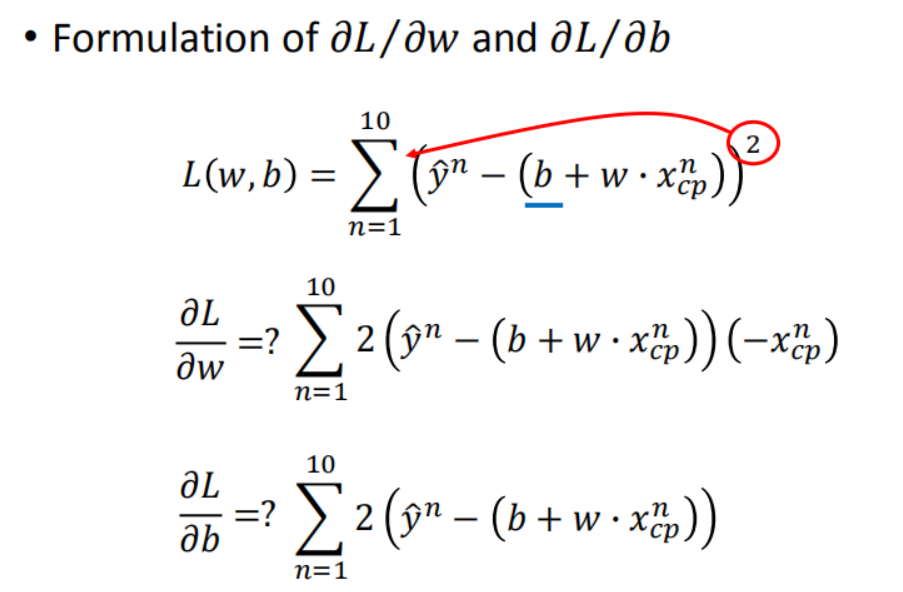
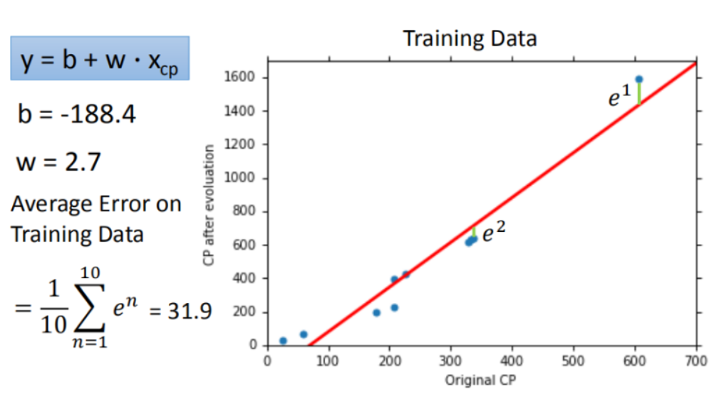
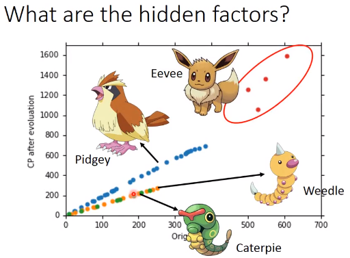
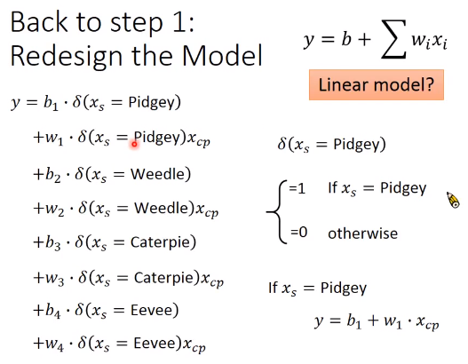
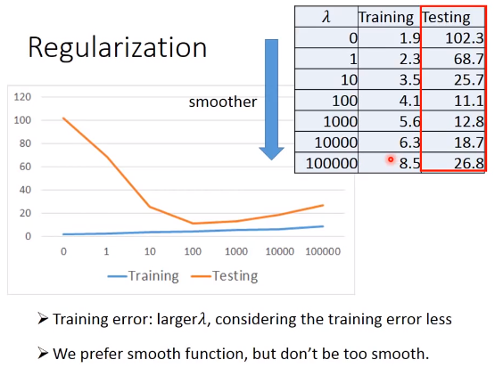
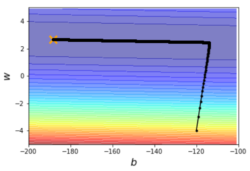

# Task02-回归笔记

## P3 回归

Regression 找到一个函数function，输入特征X，输出一个数值Scalar

### 模型步骤

- Step1：模型假设，选择模型框架
- Step2：模型评估—>损失函数loss function
- Step3：模型优化

### Step1：模型假设——线性函数

y = w · x + b

参数w和b需要假设

Multi-Linear Model
$$
y\ =\ b\ +\ \sum{w_ix_i}
$$

- 特征feature——> x_i
- 权重weight——>w_i
- 偏移量bias——>b
- 输出scalar——>y

设置training data——>(x_1, y_1)、... 、(x_n,y_n)

### Step2：模型评估——损失函数

loss function 损失函数
$$
L\ =\ L(w,b) \\
\qquad\qquad\qquad = \sum_{n=1}^{10}{(\hat{y}_n-(b+w·x_n))^2}
$$
L越大，模型误差越大

### Step3：Best Function模型优化——梯度下降

$$
f^*=arg\ \min_{w,b}{L(f)}\\
w^*,b^*=arg \min_{w,b}{L(w,b)}
$$

pick the "Best" Function

#### Gradient Descent——梯度下降

- consider **L** with one parameter **w**
  - randomly pick an initial value w_0
  - compute dL/dw(w= w_0)——constant η——learning rate
    - value > 0, w decrease
    - value < 0, w increase
  - find w to make L min

**Linear Regression doesn't have local min**

- two parameters
  - the same as only w
  - compute **dL/dw** and **dL/db**
  - find **w,b** to make L min

- 整理成一个更加简洁的公式

$$
\bigtriangledown{L}=
\begin{bmatrix}
\frac{\partial{L}}{\partial{w}} \\
\frac{\partial{L}}{\partial{b}}
\end{bmatrix}_{gradient}
$$

- convex——no local optimal

#### How's the results?

使用10组原始数据进行训练

平均误差为31.9

#### How can we do better?

选择更复杂的模型

如二次多项式
$$
y=b+w_1·x+w_2·(x)^2
$$
以及n次多项式

过于复杂可能会造成**过拟合Overfitting** 

### 优化

hidden feature——种类

Back to Step1：模型建立

#### Step1：4个线性模型合并到一个模型中

通过对**Pokemons的种类**判断，将4个线性模型合并到一个线性模型当中

#### Step2：其他因素

**weight**, **HP**, **height** and so on
$$
y_{new}=y+w_9·x_{hp}+w_{10}·(x_{hp})^2+w_{11}·x_h+w_{12}·(x_h)^2+w_{13}·x_w+w_{14}·(x_w)^2
$$

Back to Step2：Regularization正则化

#### Step3：加入正则化

$$
y=b+\sum{w_ix_i}\\
L=\sum_{n}{(\hat{y}_n-(b+\sum{w_ix_i}))^2}+\lambda\sum(w_i)^2
$$

the functions(the **second** of L) with smaller w_i are better

使w_i变得尽可能小

- why smooth functions are preferred?
  - w越小，function越平滑，对输入不敏感
    - smaller w_i means——smoother
  - we believe smoother function is more likely to be **correct**
  - if some **noises** corrupt input x_i when testing
    - a smoother function has **less influence**
  - larger **lambda**, considering the training error less
    - **对error的考虑越少**
  - how smooth?——select **lambda** obtaining the best model
    - 也不希望太平滑——需要调整lambda

**validation**

## P4回归实例

见Gradient Descent Demo

**根据b, w自适应learning rate**

