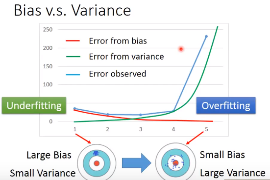
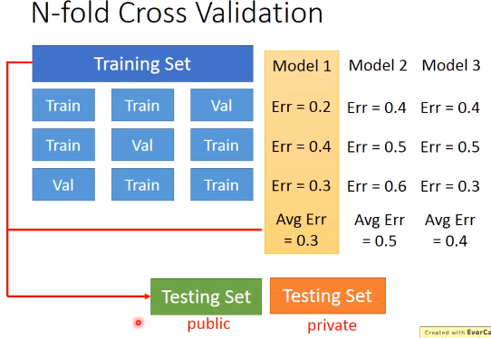

# Task03-误差+梯度下降

## P5 误差

**Bias and Variance of Estimator**估计量的偏差和方差

### 估测

估测变量x的偏差和方差

Estimate the mean of a  variable x

- assume the mean of x is μ

区分bias，error，variance

Diagnosis诊断

- model cannot even fit the training examples, then you have large bias——**underfitting**

  - redesign the model
  - add more features as input
  - a more complex model

- fit the training data, but large error on testing data, then you probably have large variance——**overfitting**

  - more data

    通过不同方法使原数据变化为其他类型的数据，比如图片反转就可以作为新数据进行输入

  - regularization正则化

Model Selection 模型选择

- 在偏差和方差中权衡
- 选择一种模型使得总误差最小
- 用训练集训练不同模型，在测试集上比较误差，但不能认为哪个模型误差小，该模型就好
  - 由于测试集是有偏差的，放在其他测试集可能误差会更大

- 交叉验证
  - 将训练集分为2部分，一部分作为训练集，一部分作为验证集，用训练集训练模型，再在验证集下比较，确定出最优模型后，再用全部训练集训练最优模型，然后用测试集进行测试
  - 此时得到误差较大，但不推荐返回调参，有可能会把测试集的偏差考虑进去

- N-fold 交叉验证

## P6 梯度下降Gradient Descent

回归问题的第三步中，需要解决最优化问题
$$
\theta^*=arg_{\theta}minL({\theta})
$$
L loss function   θ  parameters

### 调整学习速率learning rate

- 自适应学习速率——随着次数的增加，通过一些因子来减少学习率

Adagrad算法

- 每个参数的学习率都把它除上之前微分的均方根

$$
w^{t+1}<-w^t - \frac{η^t}{\sigma^t}g^t
$$

- 分母：之前参数的所有微分的均方根，对于每个参数是不一样的。
- 梯度越大时，step应该越大，但由于分母的影响，step会变小

### 随机梯度下降法

损失函数不需要处理训练集所有的数据，选取一个例子x^n
$$
L=(\hat{y}^n-(b+\sum{w^ix_i^n}))^2\\
\theta^i=\theta^{i-1}-\eta\bigtriangledown{L^n(\theta^(i-1))}
$$

### 特征缩放

- 为什么要缩放
- 缩放方法

### 泰勒展开式

## P7 梯度下降(AOE)

无法判断local minimum是否是global minimum

## P8 梯度下降(Minecraft)

使用梯度下降方法更新参数，为什么loss function **不降反增**

- 判断——前方比较低，右方比较低
  - 做法——会向右前方踏出一步

但是可能正好右前方是一个凸点