# Task03-深度学习简介+反向传播

## P13 深度学习简介

### Ups and downs of Deep Learning

- 1958: Perceptron(linear model)
  - 1969 Perceptron has limitation
- 1980s: Multi-layer perceptron
  - Do not have significant difference from DNN today
- 1986: Backpropagation
  - usually more than 3 hidden layers is not helpful

- 1989: 1 hidden layer is "good enough", why deep?
- 2006: RBM initialization(**breakthrough**)
- 2009: GPU

### Deep Learning

#### Three Steps for Deep Learning

- define a set of function——神经网络
- goodness of function
- pick the best function

#### Neural network

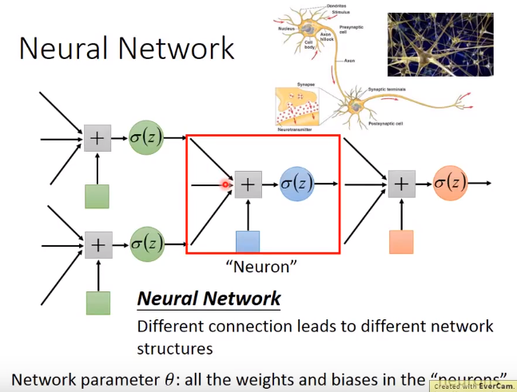

neurons 神经元

- fully connect feedforward——全连接

前馈（feedforward）也可以称为前向，从信号流向来理解就是输入信号进入网络后，信号流动是单向的，即信号**从后流向前**，一直到输出层，其中任意两层之间的连接并没有反馈（feedback），亦即信号没有从后一层又返回到前一层

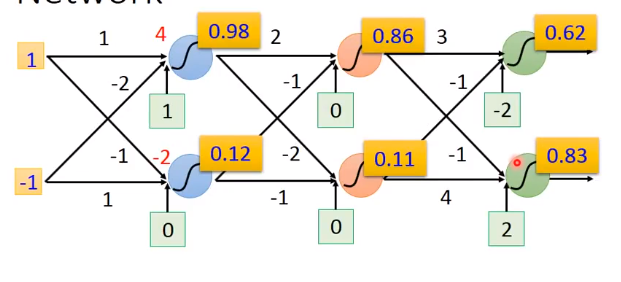

构成了一个function set，包含了参数不同的函数

Layer 1、Layer 2、...、Layer n

- 全连接——两层之间两两神经元都有连接
- 前馈——传递方向是从1到2，从2到3，...，**由后向前传** 

- 1 input layer + 1 output layer
- Deep = many hidden layer
- 层数变多，错误率下降，随之运算量增多，loop循环效率变低
  - 这些操作可以用矩阵运算来执行，提高效率

一层层的**嵌套运算**

整个神经网络的本质

通过隐藏层进行特征替换Feature extractor replacing

=Multi-class Classifier

分类器

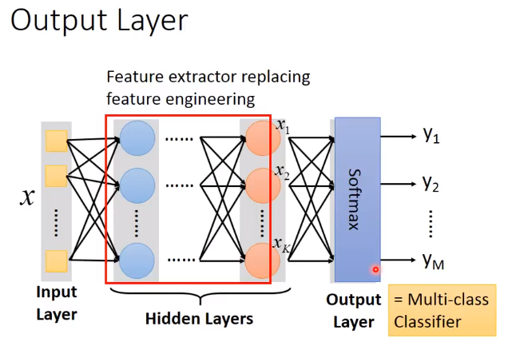

归一化——**Softmax**

**Structure Design**

- logistics regression(逻辑回归)或者linear regression对model structure的要求不高
- 但对于神经网络，我们的限制只有输入、输出，未确定hidden layer
  - Trial and Error + Intuition(试错+直觉)
- A function set containing the candidates for recognition

#### 模型评估

计算cross entropy(交叉熵)

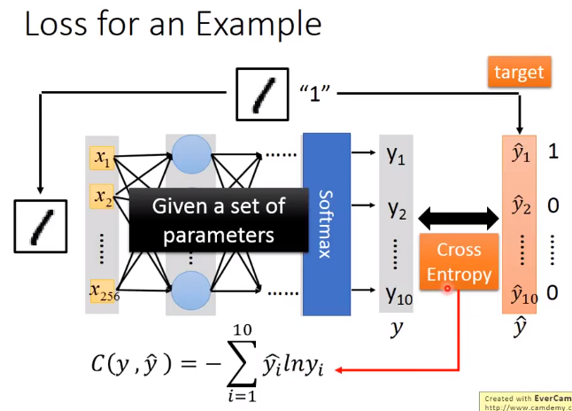

总体损失

计算整体所有训练数据的损失，然后把所有的训练数据的损失都加起来，得到总体损失L

接下来是找到最优的函数组合，或者找一组神经网络的最优参数

#### 选择最优函数

损失函数——找出使L最小的function set

- 方法：**梯度下降**

$$
\bigtriangledown{L}=
\begin{bmatrix}
\frac{\partial{L}}{\partial{w_1}} \\
\frac{\partial{L}}{\partial{w_2}} \\
.\\
.\\
\frac{\partial{L}}{\partial{b_1}}\\
.
\end{bmatrix}
$$

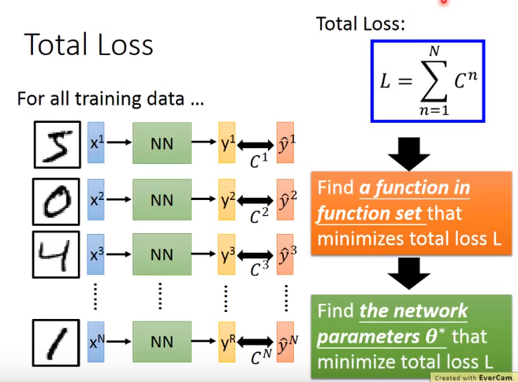

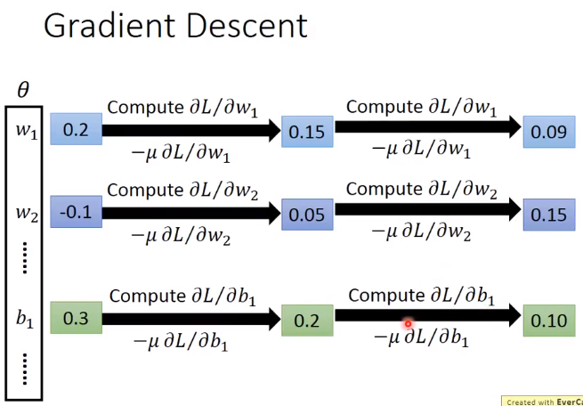

Backpropagation——反向传播

an efficient way to compute 微分 in neural network

**思考**：

为什么一个hidden layer可以表示成为任何的function，为什么还要Deep呢？

## P14 反向传播

Backpropagation

### 背景

#### 梯度下降

和linear regression没什么太多区别，但是参数很多

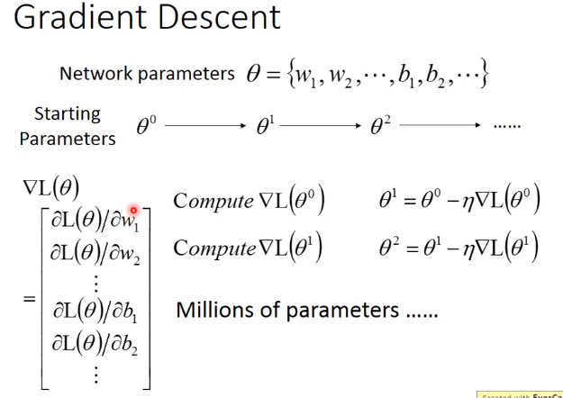

- 如何有效计算这些呢？
  - 可以用反向传播

#### Chain Rule——链式法则

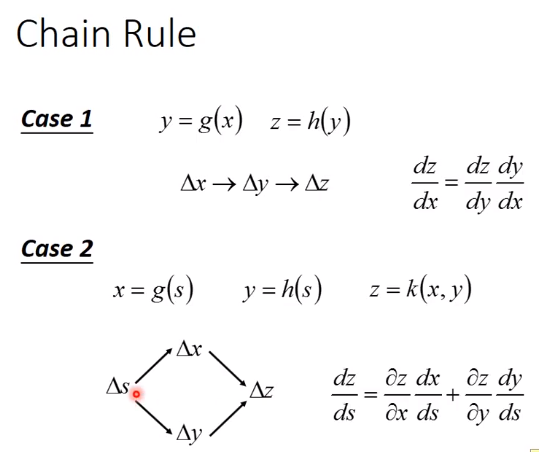

- 根据框图可以发现，出现连锁影响
- BP主要用到了chain rule

### 反向传播

$L(\theta)=\sum_{n=1}^N{C^n(\theta)}$$\longrightarrow$$\frac{\partial{L(\theta)}}{\partial{w}}=\sum_{n=1}^N{\frac{\partial{C^n(\theta)}}{\partial{w}}}$

- 计算出单个训练样本的误差C^n^
- 求和得到总体误差——损失函数L
- 代价函数(cost function)定义在整个训练集中，所有样本误差综合的平均，有无此平均不会影响最后的参数求解结果

#### Forward pass

Compute $\frac{\partial{z}}{\partial{w}}$ for all parameters

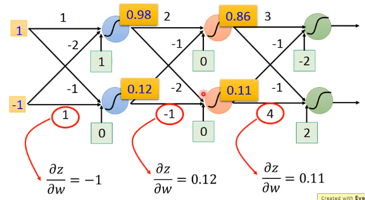

#### Barkward pass

Compute $\frac{\partial{C}}{\partial{z}}$ for all **activation function** inputs z

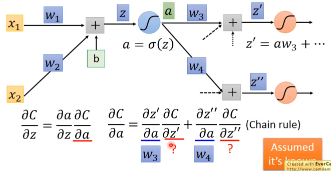

假设？两项已知

可得
$$
\frac{\partial{C}}{\partial{z}}=\sigma'(z)[w_3\frac{\partial{C}}{\partial{z'}}+w_4\frac{\partial{C}}{\partial{z''}}]
$$
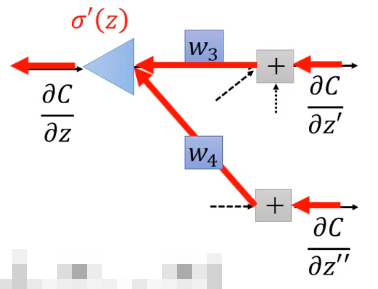

$\sigma'(z)$是常数，因为z已经被forward pass确定好

最后的两项的计算方法：

- Case 1. Output Layer——Output y_1、y_2
  - $\frac{\partial{C}}{\partial{z'}}=\frac{\partial{y_1}}{\partial{z'}}\frac{\partial{C}}{\partial{y_1}}$
  - $\frac{\partial{C}}{\partial{z''}}=\frac{\partial{y_2}}{\partial{z''}}\frac{\partial{C}}{\partial{y_2}}$

- Case 2. Not Output Layer
  - 设置z_a，z_b，嵌套向后传递，传递到输出层，按case 1开始反向计算

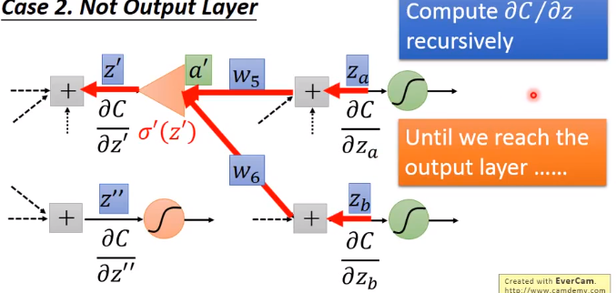

换一种想法很简单

Compute $\frac{\partial{C}}{\partial{z}}$ from ==the output layer==

 建一个反向的neural network，从右向左传递

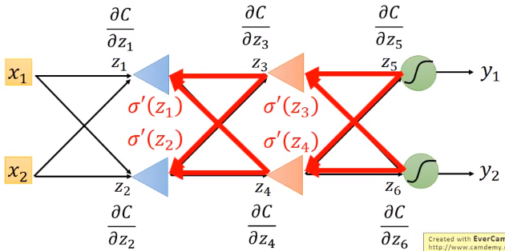

#### Summary

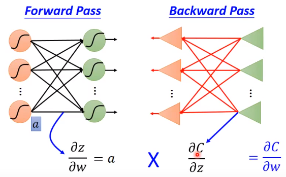