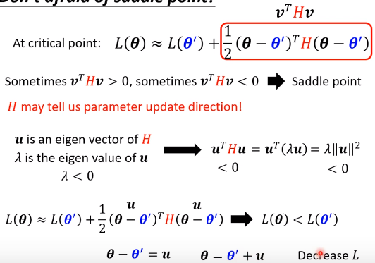
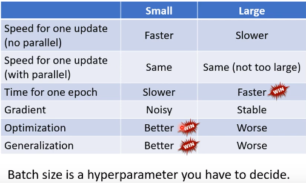
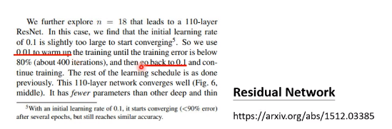
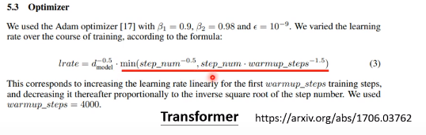
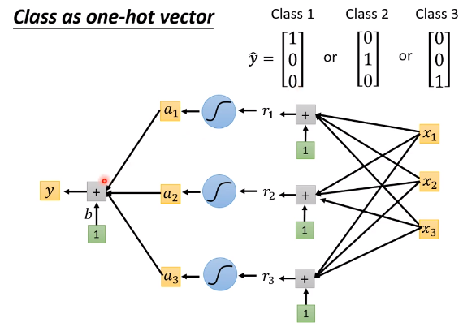

## Task05-网络构建-2021

### P5 类神经网络训练不出来怎么办——局部最小值(local minima)和鞍点(saddle point)

为什么Optimization Fails

卡在局部最小点or鞍点  gradient = 0

这些点统称为critical point——写论文术语

Which one? —— Need to find

- local minima - no way to go
- saddle point - escape

- **Tayler Series Approximation**

Gradient 一次微分

Hession 里面有二次微分的项

走到critical point时，绿项为0，红项告诉我们点的位置

positive definite正定  =  All eigen values are positive

negative definite负定 = All eigen values are negative

- **Hession may tell us parameter update direction**

u is an eigen vector of H

λ is the eigen value of u

$u^THu=u^T(\lambda{u})=\lambda{\Arrowvert{u}\Arrowvert^2}$

if $\theta-\theta'=u$，$L(\theta)<L(\theta')$，**Decrease L**

==实际使用时很少用Hession算出来，计算量很大==

Saddle point v.s. Local minima

哪个出现更频繁一点呢

可能和**维度**有关

### P6 类神经网络训练不出来怎么办——批次(batch)与动量(momentum)

把L分成多个batch，然后$\theta^*=arg \min_{\theta}L$

1epoch = see all the batches once

**Shuffle洗牌** after each epoch

为什么要用batch

#### Small Batch v.s. Large Batch

Consider 20 examples (N = 20)

左边未分batch训练时间较长，但是有效，不过可以进行**并行**计算；右边训练时间较短，但噪声较大

因此，适量大的batch也挺好用的

- 小batch的结果在training上可能得到较好结果
- 大batch可能会导致Optimization Fails
- "Noisy"更新在training中可能更好
- 小batch在testing中表现更好

- Small batch is better on testing data?
  - 测试时，LB的精确度低表示“过拟合”

而且小batch的noise很大，很容易就跳出峡谷

==做一个比较==

如何让两者兼得呢？

#### Momentum——动量

(Vanilla) Gradient Descent

Gradient Descent + Momentum

考虑过去gradient影响的总和

举一个一维的例子

#### Concluding Remarks

- Critical points have zero gradients——local minima and saddle points
- Can be determined by the **Hessian** matrix
- It is possible to escape saddle points along the direction of eigenvectors of the Hession matrix
- local minima may be rare
- Small batch size and momentum help escape critical points

### P7 类神经网络训练不出来怎么办——自动调整学习速率(Learning rate)

Training stuck ≠ Small Gradient

Different parameters needs different learning rate

Root Mean Square——均方根

$\sigma_i^t=\sqrt{\frac{1}{t+1}\sum{_{i=0}^t}(g_i^t)^2}$

- 每一个gradient都有同等的重要性

- used in ==Adagrad==
- learning rate $\frac{\eta}{\sigma_i^t}$

以上并不是最终版本

Learning rate adapts dynamically

==Error Surface can be very complex==

新的招数——RMSProp

$\sigma_i^t=\sqrt{\alpha(\sigma_i^{t-1})^2+(1-\alpha)(g_i^t)^2}$

- $0 < \alpha < 1$，可更改不同位置gradient的影响
- recent gradient影响最大
- the past gradient影响较小

最常用的方法

==**Adam: RMSProp + Momentum**==

 

Pytorch已做好套件，预设参数就很好

加上Adaptive Learning Rate

- 纵轴梯度很小的时候，自适应的learning rate就会变得很大，出现强烈变化

怎么解决这个问题

**Learning Rate Scheduling**

- Learning Rate Decay
- Warm up

对于Warm up

Learning Rate要先变大，再变小

被当作一个黑科技

为什么需要Warm up

- At the beginning, the estimate of $\sigma_i^t$ has large variance
- Please refer to RAdam

**Summart of Optimization**

可不可以直接改error surface，使其变平滑

### P8 类神经网络训练不出来怎么办——损失函数(loss function)也可能有影响

==Classification==

Classification as Regression?

分类，将编号作为数值

或者，将编号表示为向量

softmax

Soft-Max

- 让各样的数值变换到0~1之间
- 会让各个数值的差变大

$$
y_i'=\frac{exp(y_i)}{\sum_jexp(y_i)}
$$

How about **binary classification**?

- 直接用sigmoid

Loss of Classification

- $L = \frac{1}{N}\sum_n{e_n}$
- Mean Squrae Error(MSE)均方误差  $e=\sum_i(\hat{y}_i-y_i')^2$
- Cross-entropy交叉熵  $e=-\sum_i\hat{y}_ilny_i'$
- ==**Minimizing cross-entropy**== is equival to ==**maximizing likelihood**==最大化可能性
- 从optimization角度来看，cross-entropy更好

### P9 类神经网络训练不出来怎么办——批次标准化(Batch Normalization)简介

能不能直接改error surface

Changing Landscape

#### **Feature Normalization**

- For each dimension i, compute mean: $m_i$ and standard deviation $\sigma_i$

#### Considerng Deep Learning

