## Task06-CNN

### P21 卷积神经网络

常被用在影像处理中

我们想知道某个Image的pattern，不需要都看，只需要找到特征Feature就好

Image Filter

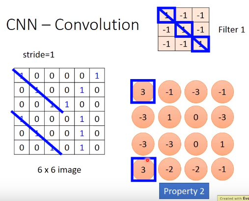

根据这个Filter，我们可以找到**对角线连续为1**的特征

**Feature Map**

其数量和Filter数量一致

Share weights

相比于Full-connected，可以使得所需权重数减少

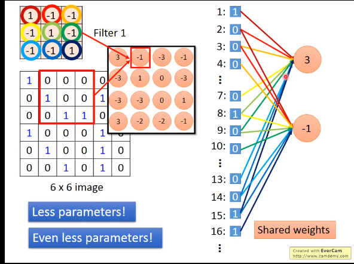

- Convolution
- Max Pooling
  - 选取该分块中最大值作为该分块代表，使得尺寸变小
  - 维数看Filter

- 经过以上两次操作后，得到一个new image，尺寸小于初始图像，通道数or维数是filter数

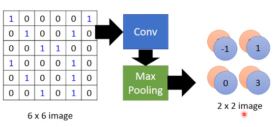

- Flatten
  - 多维展成一列
- Fully Connected Feedforward network

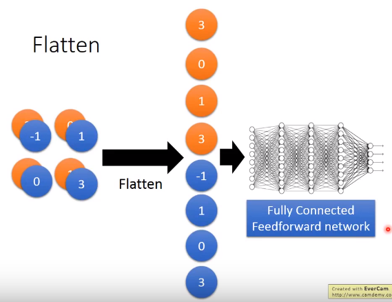

### CNN in Keras

Only modified the network structure and input format

vector  —> 3-D tensor

层及参数的设置

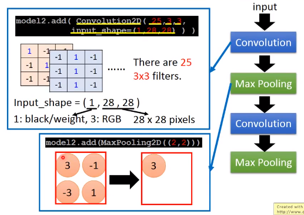

具体运算流程

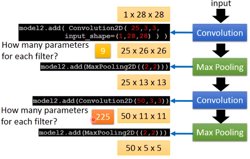

最后得到的结果要经过Flatten层和Fully-Connected层送给输出

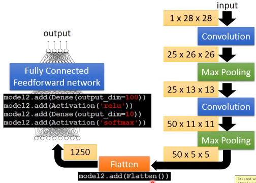

Live Demo

使用Keras的程序接口

### What does CNN learn?

分析不同层的用处

The output of the k-th filter is a 11×11 matrix

我们现在定义一个参数

- Degree of the activation of the k-th filter

$$
a^k= \sum_{i=1}^{11}\sum_{j=1}^{11}a_{ij}^{k}
$$

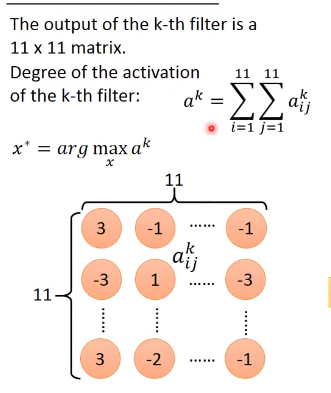

找到输入$x^*$使得某filter输出的$a_k$最大
$$
x^*=arg \underset{x}{max}\  a^k
$$
gradient ascent or descent梯度上升or下降

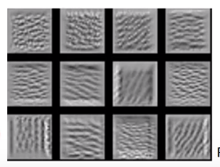

最后得到的输入图像如上，可以发现不同的Filter对不同的特征具有不同的兴趣

但是这个特征只是图片上的一些纹理，或者**小特征**，在整张图中反复出现

可以用作特征提取

分析Fully-connected层

定义一个参数

- find an image maximizing the output of neuron

$$
x^*=arg \underset{x}{max}\  a^j
$$

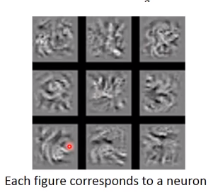

在做flatten之后，每个neural要做的工作是

- 看整张图，最让neural激活的是**完整的图形**or pattern

考虑输出(如果是文字识别，则输出是10维)

把某一维输出找出来，然后找一张输入图像使得$x^*$最大，得到的图片如下
$$
x^*=arg \underset{x}{max}\  y^i
$$
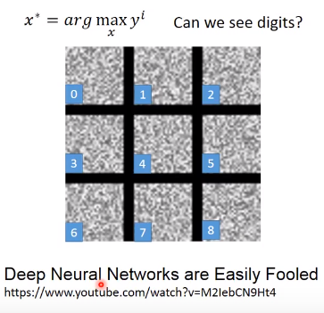

我们发现机器学习学到的东西和人的正常认知是**不一样**的

优化例子

怎么样可以让这个图片看起来像数字

让这个图片大部分背景是暗色而非白色

因此我们需要对$x^*$做一些优化regression
$$
x^*=arg\  \underset{x}{max}\  (y^i-\sum_{i,j}\arrowvert{x_{ij}}\arrowvert)
$$
某一Image的总像素值表示为：$\sum_{i,j}\arrowvert{x_{ij}}\arrowvert$

找到的$x^*$可以让该Image的总像素值相对较小，从而获得较大暗背景

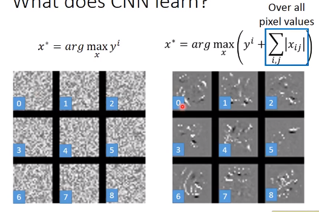

效果看起来有一点成效

Deep Dream

CNN exaggerates what it sees

调整filter或hidden layer参数(正值调大，负值调小)，让CNN对它认为像什么的地方进行强化增强

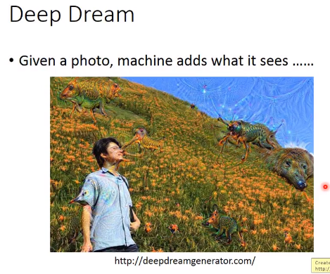

Deep Style

使原图像像一幅名画

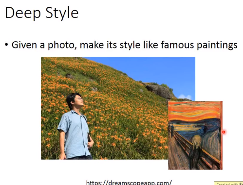

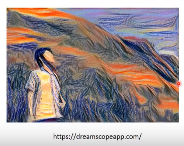

其工作原理及流程如下

- 先得到两种图的filter、训练参数和output
  - output value代表这张图里面有什么内容特征
  - convolution代表一张图的Style
- 用同样的CNN找一张图可以同时maximize两边
- 方法及刚才讲的gradient ascent

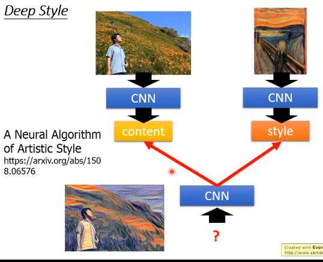

**More Application**

- 下围棋

一般topic neuron network也可以做到

但是CNN表现更好

有Supervise Learning 也有Reinforce Learning

CNN用于下围棋的原因

- Some patterns are much smaller than the whole image

  比如pattern比整张图小得多，只看一部分就可以了解某些特征

  Alpha Go 在第一层用5×5的过滤器

- The same patterns appear in different regions

  同样的pattern会出现在不同的region，但是代表的意义是一样的

- Subsampling the pixels will not change the object

  但是Max Pooling对整体棋盘应该不起作用——==如何解释==

根据论文可以发现，Alpha Go没有用Max Pooling

用19×19×48作为输入image，每一个位置用48个值进行表示，包括是否有棋子，该棋子的状态等(domain-knowledge)

- 语音处理

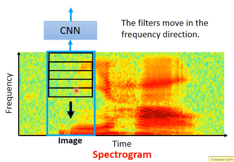

根据特性设计CNN

- 文本处理

每一个word用一个vector来表示

如果两个word含义越接近，则其vector在高维空间上越接近，即word embedding

将sentence里面所有的word排在一起，就变成一张image

然后把CNN套在这个image上

只会在时间维度上(或者语句组词顺序)移动，而不会在embedding(嵌入) dimension上移动

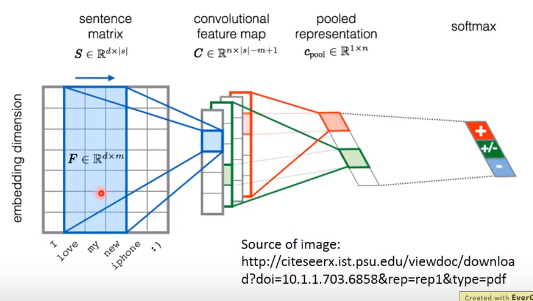

### To Learn more…

- visualiation  视觉

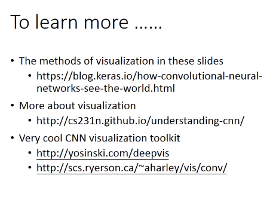

- 有些方法可以使得machine在看过数据库里面的图之后，自动画出清晰的类似图(如手写字符识别)——PixelRNN、VAE、GAN

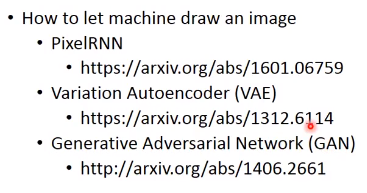